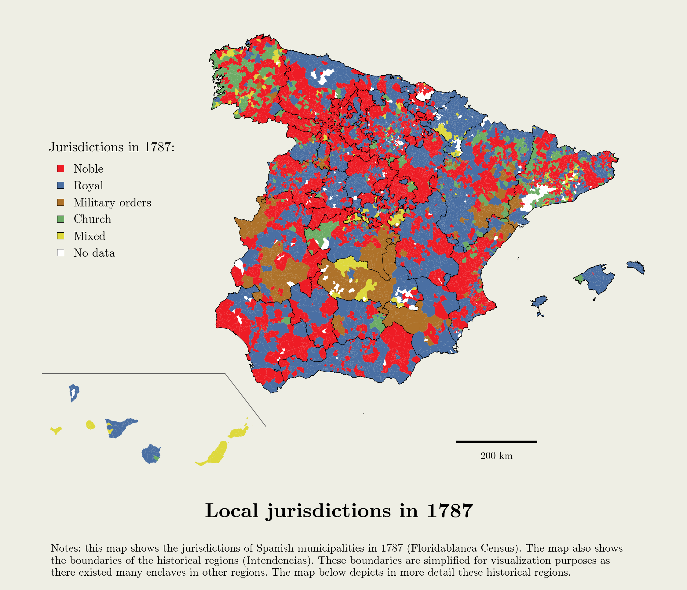

## Lordships

This page provides a **dataset about ancien-regime Spain** collected for the paper ["Delegating governmental authority to private actors: Lordships, state capacity and development"](https://doi.org/10.1016/j.eeh.2025.101737) (forthcoming in *Explorations in Economic History*).

  

  

<h6 align="center">Click on image for full resolution</h6>

  

The dataset includes institutional, demographic, and labor-occupational variables of all population entities covered by the Floridablanca Census of 1787 ([INE](https://www.ine.es/ss/Satellite?L=es_ES&c=INEPublicacion_C&cid=1259949437001&p=1254735110672&pagename=ProductosYServicios%2FPYSLayout&param1=PYSDetalleGratuitas)). 
The data are provided aggregated by the current municipalities. The dataset further includes a large array of climatic and geographic variables for Spain as well as additional institutional and historical variables.  

  

| Table (link)  | Content (variables) |
| ------------- | ------------- |
| [Floridablanca 1787 Census](https://github.com/otoperalias/Lordships/raw/refs/heads/main/files/CFB1787_v1.xlsx)  | Jurisdictional status, [historical regions (*intendencias*)](files/map_intend.png), locality category, total population, population in collective households, population classified by job occupation  |
| [Geographic and climatic dataset](https://github.com/otoperalias/Lordships/raw/refs/heads/main/files/geoclimatic_v1.xlsx)  | Surface area, altitude, ruggedness, distance to the coast, distance to Madrid, distance to the provincial capital, distance to a major river, temperature, rainfall, soil quality, aridity, latitude, longitude  |
|  [Additional institutional and historical data](https://github.com/otoperalias/Lordships/raw/refs/heads/main/files/other_institutional_v1.xlsx)  | Head of judicial district in 1834, Civil Guard Barrack in 1853, Post office in 1830, Post office in 1878, (Royal) Salt administration, Distance to Modern Era roads, Distance to pre-medieval settlements, Distance to Roman Roads  |

  

**Please cite the data as**: Oto-Peralías, Daniel (2025). "Delegating governmental authority to private actors: Lordships, state capacity and development". *Explorations in Economic History*, forthcoming. https://doi.org/10.1016/j.eeh.2025.101737 
  

