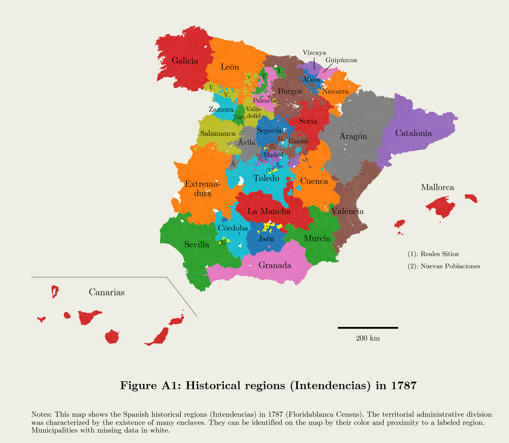

## Lordships

This page provides a dataset about ancien-regime Spain collected for the paper "Delegating Governmental Authority to Private Actors: Lordships, State Capacity and Development" (Daniel Oto-Peralías...).

The dataset includes institutional, demographic, and labor-occupational variables of all population entities covered by the Floridablanca Census of 1787 ([INE](https://www.ine.es/ss/Satellite?L=es_ES&c=INEPublicacion_C&cid=1259949437001&p=1254735110672&pagename=ProductosYServicios%2FPYSLayout&param1=PYSDetalleGratuitas)). 
The data are provided both for 1787 localities and aggregated for current municipalities. 
It further includes a large array of geographic variables for Spain and additional data for its south-western region of the Kingdom of Granada.

  

> **Spanish dataset: [click here to download](www.asdfasdfasdf)** [UNDER CONSTRUCTION]

> **Granada dataset: [click here to download.](www.asdfasdfasdf)** [UNDER CONSTRUCTION]

**Please cite the data as**: Daniel Oto-Peralías (2025). "Delegating Governmental Authority to Private Actors: Lordships, State Capacity and Development" ASDFASDFASDF

The code to replicate the paper is available [here](www.asdfasdfasdf) [UNDER CONSTRUCTION]
 
  

  

  

  

